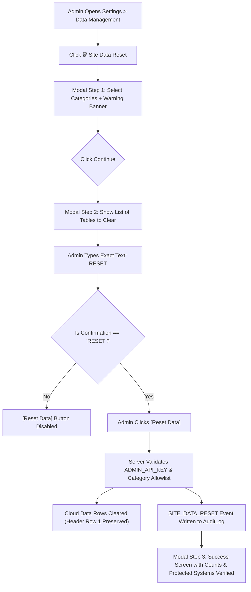

# VE Management: Admin "Site Data Reset" Control Specification

**Target Application:** IT/ITeS Attendance & Academic Management System (Android Admin App & Google Apps Script Backend)  
**Target School:** Gameri Higher Secondary School, Gamiri  
**Document Version:** 1.0  
**Effective Date:** 28 August 2026  

---

## 1. Purpose
The **Site Data Reset** control enables school administrators to safely and selectively reset Parent Portal cloud and site data in Google Sheets during testing, staging transitions, or controlled academic year reinitialization.

> [!IMPORTANT]
> **This is NOT a device wipe.**  
> The reset operation is strictly confined to cloud records in Google Sheets and **never touches Android local storage, SQLite databases, biometric facial descriptors, or official academic calendars.**

---

## 2. What Can Be Reset (Resettable Cloud Categories)

The following cloud datasets can be individually or collectively selected by the administrator:

| Category Identifier | Target Sheet Name | Description & Impact |
| :--- | :--- | :--- |
| `parents` | `Parents` | Parent portal login accounts. When reset, parents cannot log in until re-registered. |
| `parent_students` | `ParentStudents` | Parent-to-student authorization links. |
| `attendance` | `Attendance` | Cloud-synced attendance records. |
| `marks` | `Marks` | Cloud-synced exam and unit test marks. |
| `activities` | `Activities` | Vocational workshop & activity posts. |
| `notices` | `Notices` | School announcements and notice board items. |
| `documents` | `Documents` | Cloud syllabus & academic PDF links. |
| `achievements` | `Achievements` | Student recognition & award entries. |
| `derived_notifications` | *(Virtual / Cache)* | Ephemeral notification queues & alerts. |

---

## 3. What Is Strictly Protected (Never Resettable)

The following core assets are permanently excluded from the reset mechanism and cannot be modified by any portal reset action:

- **Students Master Directory (`Students` sheet):** Core student enrolments, IDs, roll numbers, sections, and trades remain 100% intact.
- **Official ASSEB Academic Calendar (`AcademicCalendar` sheet):** Official 2026–27 academic schedule with 254 working days and government holidays.
- **Android Local Database & Storage:** Local attendance records, student profiles, and cached data on the Android device.
- **Biometric Facial Descriptors (`itd3_f`):** Face recognition embeddings stored securely on the local device.
- **Google Drive Backups:** Periodic JSON database snapshots saved in Google Drive.
- **Native Reminder & Timetable Schedules:** AlarmManager schedules and notification triggers.
- **Admin Credentials & Security Keys:** `ADMIN_API_KEY`, `SERVER_SECRET`, and admin passwords.
- **Security Audit Logs (`AuditLog` sheet):** Historic audit trail records survive resets.

---

## 4. Admin Double-Confirmation Workflow

To prevent accidental destruction of cloud data, the reset workflow enforces a mandatory two-step confirmation:



### Confirmation Safeguards:
1. **Case-Sensitive Input:** The input must match `"RESET"` exactly (typing `"reset"`, `"confirm"`, or empty spaces leaves the button disabled).
2. **Special Warning for Parents:** When `parents` or `parent_students` is checked, a clear alert informs the administrator: *"⚠️ Parents will need to be recreated/re-linked before they can log in."*

---

## 5. Backend API Specification

### Endpoint:
`POST https://script.google.com/macros/s/<DEPLOYMENT_ID>/exec`

### Headers:
`Content-Type: text/plain;charset=utf-8`

### Request Payload:
```json
{
  "action": "reset_parent_portal_data",
  "apiKey": "GHSS_ADMIN_SECURE_KEY_2026",
  "categories": [
    "parents",
    "parent_students",
    "attendance",
    "marks",
    "activities",
    "notices",
    "documents",
    "achievements",
    "derived_notifications"
  ],
  "confirmation": "RESET"
}
```

### Response Envelope:
```json
{
  "success": true,
  "action": "reset_parent_portal_data",
  "data": {
    "success": true,
    "action": "reset_parent_portal_data",
    "message": "Parent Portal cloud data reset successfully.",
    "categories": ["notices", "documents"],
    "countsBefore": { "notices": 8, "documents": 4 },
    "countsAfter": { "notices": 0, "documents": 0 },
    "summary": {
      "notices": "8 records cleared",
      "documents": "4 records cleared"
    },
    "protected": {
      "students": "Preserved (Master Records)",
      "academicCalendar": "Preserved (Official ASSEB 254 Working Days)",
      "androidLocalData": "Preserved (Offline-First Device Storage)",
      "faceRecognition": "Preserved (Local Biometric Descriptors)",
      "googleDriveBackup": "Preserved (Cloud Archive)",
      "adminCredentials": "Preserved (ADMIN_API_KEY & SERVER_SECRET)"
    },
    "timestamp": "2026-08-28T18:30:00.000Z"
  },
  "error": null,
  "timestamp": "2026-08-28T18:30:00.000Z"
}
```

---

## 6. Audit Logging (`AuditLog` Sheet)
Every execution of `reset_parent_portal_data` automatically appends an immutable entry to `AuditLog`:

- **`action`**: `SITE_DATA_RESET`
- **`actorType`**: `ADMIN`
- **`actorId`**: `ADMIN_APP`
- **`details`**: `{ "categories": [...], "countsBefore": {...}, "countsAfter": {...} }`
- **`status`**: `SUCCESS`
- **`timestamp`**: ISO 8601 UTC timestamp

> [!NOTE]
> Audit records are written directly to `AuditLog`, which is preserved across all resets. Sensitive secrets, tokens, hashes, and API keys are never written to logs.

---

## 7. Sync Implications & Recovery
1. **Local SyncQueue Preservation:** Resetting cloud data does **not** erase local pending sync queues on the Android app.
2. **Repopulation via Sync:** Local attendance and student data remain safely cached in the Android app. Clicking **"🔄 Sync Now (to Cloud)"** in the Admin app will instantly repopulate cloud tables from the local master dataset.
3. **Parent Portal Empty State:** If all parent records are cleared, the Parent Portal gracefully displays standard *"Invalid credentials / No parent account found"* without application crashes.

---

## 8. Automated Verification Test Suite

Test suite: [`scratch/test_site_data_reset.js`](file:///c:/Users/HP/Downloads/ITGHSS2/scratch/test_site_data_reset.js)

| Test Area | Scenarios Covered | Result |
| :--- | :--- | :---: |
| **Admin UI & Modals** | Reset button placement in Settings, modal step progression | **PASS ✅** |
| **Authorization & Security** | Parent token blocking, Admin key enforcement | **PASS ✅** |
| **Input Validation** | Category allowlist, confirmation string case sensitivity | **PASS ✅** |
| **Category Clearing** | Parents, Links, Attendance, Marks, Notices, Docs, Activities, Achievements | **PASS ✅** |
| **Protected Master Data** | Students directory, ASSEB Calendar, Drive backups, Biometrics | **PASS ✅** |
| **Schema Integrity** | Header row preservation (Row 1 intact) | **PASS ✅** |
| **Audit Trail** | SITE_DATA_RESET logging, post-reset log survival | **PASS ✅** |
| **Parent Portal UX** | Graceful empty state and authentication failure handling | **PASS ✅** |
| **Summary & Metrics** | 30 / 30 Scenarios | **100% PASS ✅** |
