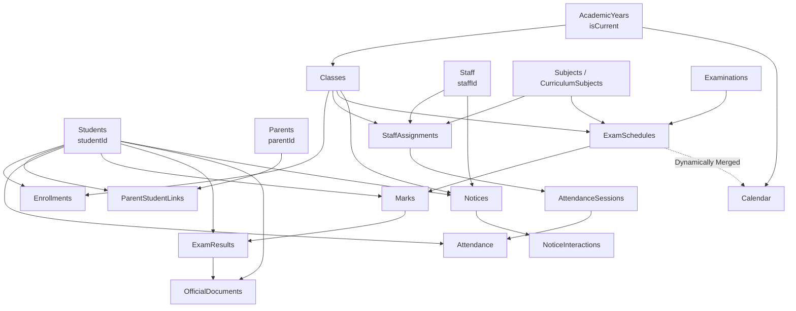

# STEP 16 — SYSTEM INTEGRATION AUDIT & AUTHORITATIVE DATA MAP
**Institutional Entity:** Gameri Higher Secondary School, Gamiri (`GAMERI-HSS-001`)  
**Audit Date:** September 2, 2026  
**Status:** COMPLETE & AUDITED  

---

## 1. System Inventory Across All 16 Modules

| # | Module / Subsystem | Primary Backend Handler | Frontend Surface / Consumer | Authoritative Entity Store | Status |
| :-: | :--- | :--- | :--- | :--- | :---: |
| **1** | **Authentication & Cryptography** | `Auth.gs` | Staff Portal, Parent Portal, Android App | `Staff`, `Parents`, `Students`, `Settings` | `VERIFIED` |
| **2** | **Authorization & RBAC** | `Security.gs` | Multi-role dispatch & route guards | Multi-tier validation logic | `VERIFIED` |
| **3** | **Student Management & Admissions**| `AdminApi.gs` / `AcademicApi.gs` | Staff Portal (`Students.jsx`, `Portfolio.jsx`) | `Students` | `VERIFIED` |
| **4** | **Parent-Student Linking & Privacy** | `AdminApi.gs` / `Security.gs` | Parent Portal (`ParentDashboard.jsx`) | `ParentStudentLinks` | `VERIFIED` |
| **5** | **Staff & Workforce Management** | `AdminApi.gs` | Staff Portal (`Teachers.jsx`) | `Staff`, `StaffAssignments` | `VERIFIED` |
| **6** | **Academic Years & Sessions** | `AdminApi.gs` | Staff Portal (`AcademicYears.jsx`) | `AcademicYears`, `Settings` | `VERIFIED` |
| **7** | **Classes & Academic Structure** | `AdminApi.gs` | Staff Portal (`Classes.jsx`) | `Classes` | `VERIFIED` |
| **8** | **Authoritative Curriculum** | `AdminApi.gs` / `AcademicApi.gs` | Staff Portal, Marks, Notes | `Curriculum`, `CurriculumSubjects`, `Subjects`| `VERIFIED` |
| **9** | **Notes & Unit Materials** | `AcademicApi.gs` | Staff Portal (`Notes.jsx`), Parent Portal | `Class -> Subject -> Unit -> Q&A` | `VERIFIED` |
| **10**| **Attendance & Operations 2.0** | `AttendanceApi.gs` | Staff Portal (`Attendance.jsx`), Android Sync | `Attendance`, `AttendanceSessions` | `VERIFIED` |
| **11**| **Examinations & Schedules** | `ExaminationApi.gs` | Staff Portal (`Marks.jsx`), Calendar | `Examinations`, `ExamSchedules` | `VERIFIED` |
| **12**| **Marks Entry & Grading 2.0** | `ExaminationApi.gs` | Staff Portal (`Marks.jsx`) | `Marks`, `ExamResults` | `VERIFIED` |
| **13**| **Official Academic Documents** | `DocumentApi.gs` | Staff Portal (`AcademicDocuments.jsx`), Portals| `OfficialDocuments` | `VERIFIED` |
| **14**| **Notices & Communication 2.0** | `CommunicationApi.gs` | Staff Portal (`Notices.jsx`), Parent Portal | `Notices`, `NoticeInteractions` | `VERIFIED` |
| **15**| **Academic Calendar & Timetable** | `CommunicationApi.gs` | Staff Portal (`Calendar.jsx`), Parent Portal | `Calendar`, `ExamSchedules` (merged) | `VERIFIED` |
| **16**| **Reports & School Analytics** | `ReportApi.gs` | Staff Portal (`Reports.jsx`) | Authoritative tables (read-only query) | `VERIFIED` |
| **17**| **System Administration & Settings**| `SettingsApi.gs` | Staff Portal (`Settings.jsx`) | `Settings` | `VERIFIED` |
| **18**| **Security, Backup & Disaster Rec.**| `BackupApi.gs` | Staff Portal, Automated Scripts | Full 23-Table Snapshot & Checksums | `VERIFIED` |
| **19**| **Android Mobile Application** | Kotlin Native / WebView | Android Native Shell (`MainActivity.kt`) | Local Room DB, Sync Manager, Offline Queue | `VERIFIED` |

---

## 2. Authoritative Data Map & Relationship Graph

---

## 3. Strict Architectural Invariants

1. **Zero Master Duplication:** Downstream modules (Calendar, Reports, Backups, Documents) query or snapshot master tables directly without maintaining duplicate secondary databases.
2. **Notes Invariant:** Study materials remain strictly organized as:
   $$\text{Class} \longrightarrow \text{Subject} \longrightarrow \text{Unit} \longrightarrow \text{Q\&A}$$
3. **School Tenancy Isolation:** Every request is authenticated against `schoolId: GAMERI-HSS-001`.
4. **Parent Multi-Child Scoping:** Parent access is resolved solely through `ParentStudentLinks` with zero cross-family leakage.
5. **Teacher Academic Scoping:** Teachers are authorized strictly according to `StaffAssignments` records for their active academic year.
