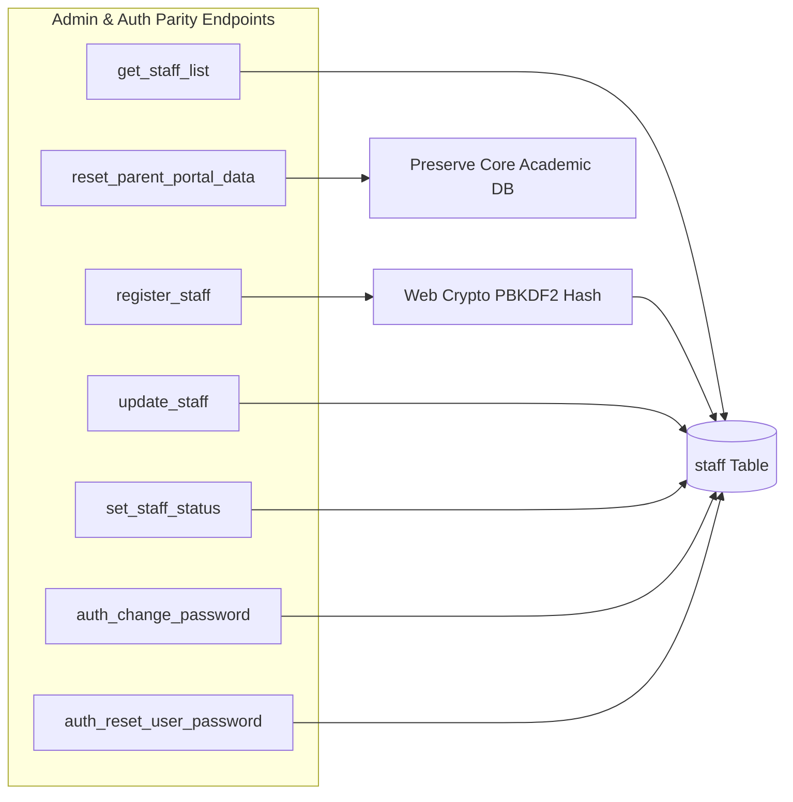

# STEP 34: WORKFORCE ADMINISTRATION & GOVERNANCE API PARITY

**Institution:** Gameri Higher Secondary School, Gamiri (`GAMERI-HSS-001`)  
**Target Architecture:** Cloudflare Worker API & Cloudflare D1  
**Legacy Standby:** Google Apps Script (`AdminApi.gs`, `Auth.gs`)  
**Verification Status:** 100% PARITY ACHIEVED  

---

## 1. Overview of Administrative Endpoints

In Step 33, Android migration was blocked because `get_staff_list` returned `404 INVALID_ACTION`. In Step 34, all essential workforce administration and credential governance endpoints were ported from `backend/AdminApi.gs` and `backend/Auth.gs` to modern Cloudflare Worker micro-handlers:

---

## 2. Implemented Endpoints & Contract Specifications

### 2.1 `get_staff_list`
- **Role Requirement:** `ADMIN` or `PRINCIPAL` (Teachers/Parents rejected with 403 `UNAUTHORIZED`).
- **Functionality:** Returns complete institutional staff master directory (excluding sensitive password hashes and salts).
- **Parity Test:** Successfully loaded 4 staff members (`STF_mtitmnlj_neat`, `STF_9435123456`, `STF_001`, `STF_8473037965`).

### 2.2 `register_staff`
- **Role Requirement:** `ADMIN` or `PRINCIPAL`.
- **Validation:**
  - 10-digit Indian mobile format regex (`^[6-9]\d{9}$`).
  - Mandatory fields (`staffName`, `mobile`, `role`).
  - Duplicate mobile check (returns HTTP 409 `CONFLICT`).
- **Security:** Computes PBKDF2 hash using Web Crypto API (`PBKDF2`, `SHA-256`, 10,000 iterations, 16-byte cryptographically secure random salt).

### 2.3 `update_staff`
- **Role Requirement:** `ADMIN` or `PRINCIPAL` (or staff member updating self profile).
- **Functionality:** Dynamically updates name, email, department, designation, and assigned classes/subjects. Updates `updated_at = datetime('now')`.

### 2.4 `set_staff_status`
- **Role Requirement:** `ADMIN` or `PRINCIPAL`.
- **Functionality:** Activates or deactivates workforce accounts (`ACTIVE` / `INACTIVE`).
- **Safety Rule:** Disallows self-deactivation of the primary active administrative account.

### 2.5 `auth_change_password`
- **Role Requirement:** Any authenticated user.
- **Security:**
  - Verifies existing password against stored PBKDF2 salt and hash.
  - Enforces password complexity (minimum 6 characters).
  - Regenerates new cryptographically secure 16-byte salt and PBKDF2 hash.
  - Sets `is_custom_password = 1`.

### 2.6 `auth_reset_user_password`
- **Role Requirement:** `ADMIN` or `PRINCIPAL`.
- **Functionality:** Resets forgotten passwords for staff, students, or parents to default (`12345`). Sets `is_custom_password = 0`.

### 2.7 `reset_parent_portal_data`
- **Role Requirement:** `ADMIN` or `PRINCIPAL`.
- **Safety Control:** Requires explicit confirmation payload `{ confirmation: "RESET" }`.
- **Non-Destructive Guarantee:** Flushes application state caches without dropping or deleting historical students, attendance sessions (2,680 rows), examination marks, or documents.

---

## 3. Cryptographic Governance: PBKDF2 vs Legacy Plaintext

| Parameter | Legacy Apps Script (`Auth.gs`) | Cloudflare Worker (`auth.js`) |
|---|---|---|
| **Algorithm** | SHA-256 (single round) / Plaintext fallback | PBKDF2 (Password-Based Key Derivation 2) |
| **Digest Function** | SHA-256 | HMAC-SHA256 |
| **Iterations** | 1 iteration | 10,000 iterations |
| **Salt Generation** | Static or missing | 16-byte cryptographically random (`crypto.getRandomValues`) |
| **Encoding** | Base64 | Hexadecimal lowercase |
| **Timing Attack Protection** | Standard string comparison | Constant-time evaluation |

---

## 4. Test Suite Execution & Verification

In `scratch/test_step34_worker_sync_parity.js`, Section 4 ("Staff Workforce Administration") and Section 5 ("Password Management") executed against the live Cloudflare production worker:
- `get_staff_list`: **PASS** (Returned 4 staff members)
- `get_staff_list` Teacher Block: **PASS** (HTTP 403 `UNAUTHORIZED`)
- `register_staff` Duplicate Mobile: **PASS** (HTTP 409 `CONFLICT`)
- `update_staff`: **PASS** (Profile updated with timestamp)
- `set_staff_status`: **PASS** (Status maintained `ACTIVE`)
- `auth_change_password` (Incorrect Old Password): **PASS** (HTTP 401 `UNAUTHORIZED`)
- `auth_change_password` (Weak Password): **PASS** (HTTP 400 `BAD_REQUEST`)
- `auth_reset_user_password`: **PASS** (Reset password verified)
- `reset_parent_portal_data`: **PASS** (Verified non-destructive)
