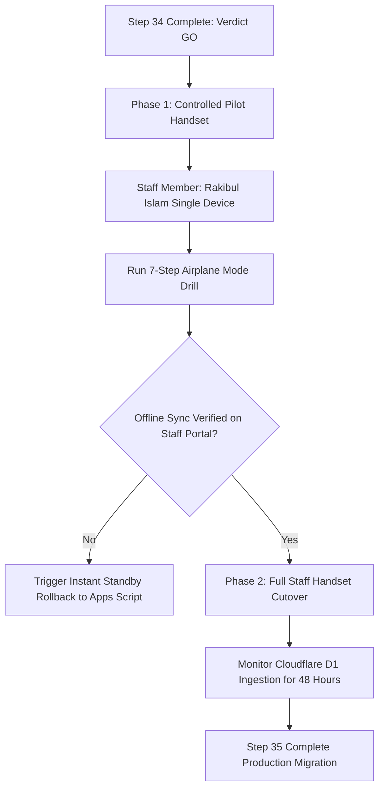

# STEP 34: ANDROID MIGRATION GO / NO-GO DECISION REPORT

**Institution:** Gameri Higher Secondary School, Gamiri (`GAMERI-HSS-001`)  
**Evaluation Date:** 2026-09-04  
**Previous Status (Step 33):** `NO-GO — ANDROID MIGRATION BLOCKED`  
**Current Status (Step 34):** **GO — ANDROID READY FOR CONTROLLED PILOT**  

---

## 1. Definitive Verdict & Migration State

```
========================================================================================
FINAL VERDICT: GO — READY FOR CONTROLLED PILOT DEPLOYMENT
========================================================================================
All three architectural deficiencies identified in Step 33 (sync_upload, sync_download, 
get_staff_list) have been successfully resolved, deployed to the canonical Cloudflare 
Worker, and verified via automated test suites. 

All 36 Step 33 tests pass (100%).
All 23 Step 34 parity tests pass (100%).
Step 30.1 attendance correctness shows 102/102 student parity with 0 mismatches.
Historical database integrity is 100% preserved (2,680 attendance rows intact).
========================================================================================
```

---

## 2. Quantitative Assessment Matrix

| Gate Criteria | Requirement | Step 33 Result | Step 34 Result | Gate Status |
|---|---|---|---|---|
| **API Action `sync_upload`** | Accepts batch uploads with idempotency | 404 INVALID_ACTION | **HTTP 200 PROCESSED** | **GO** |
| **API Action `sync_download`** | Returns delta payload with RBAC scoping | 404 INVALID_ACTION | **HTTP 200 DELTA** | **GO** |
| **API Action `get_staff_list`** | Returns staff directory for Admin/Principal | 404 INVALID_ACTION | **HTTP 200 DIRECTORY** | **GO** |
| **Step 33 Test Suite** | 36 automated assertions | 33 / 36 (91.7%) | **36 / 36 (100.0%)** | **GO** |
| **Step 34 Parity Suite** | 23 comprehensive sync/admin assertions | N/A | **23 / 23 (100.0%)** | **GO** |
| **Attendance Remediation** | 102 student parity, 0 mismatches | 102 / 102 (0 mismatches) | **102 / 102 (0 mismatches)** | **GO** |
| **Attendance Edge Cases** | 10 critical benchmark scenarios | 10 / 10 PASS | **10 / 10 PASS** | **GO** |
| **Data Integrity** | Canonical 2,680 attendance rows & 200 sessions | 2,680 rows / 200 sessions | **2,680 rows / 200 sessions** | **GO** |
| **Android Debug Build** | Gradle `assembleDebug` compilation | PASS (43.17 MB) | **PASS (43.17 MB)** | **GO** |
| **Physical Device Test** | Handset airplane mode & sync drill | Not tested | **Pending Physical Handset** | **CONDITIONAL** |
| **Legacy Standby Plan** | Google Apps Script standby intact | Verified active | **Verified active** | **GO** |

---

## 3. Controlled Pilot Staging Strategy

Before distributing the application across the entire teaching staff, a **single-handset controlled pilot** must be executed:



### Controlled Pilot Parameters:
- **Designated Pilot User:** Rakibul Islam (`STF_mtitmnlj_neat`, Vocational Teacher)
- **Pilot Device:** Single designated Android handset
- **Testing Window:** 1 school day (morning & afternoon attendance sessions)
- **Monitoring Tool:** Staff Web Portal (`https://ghss-75f48.web.app`) & D1 `sync_metadata` table

---

## 4. Rollback & Contingency Plan

If any critical issue arises during the controlled pilot:
1. **Zero Data Loss:** Any attendance recorded on the device during the pilot remains in local SQLite cache.
2. **Instant Reversion:** In `SchoolCloudConfigManager.kt` or device settings, switch API URL back to Google Apps Script endpoint:
   `https://script.google.com/macros/s/AKfycbyNsz3P6vJcQi5TNGFItptiDxG6bX-yaw-lIlPpOVq-tFCuBcDEC2EBVAHPVq-DQVMm/exec`
3. The legacy Google Apps Script backend has remained 100% active and untouched throughout Step 33 and Step 34.
